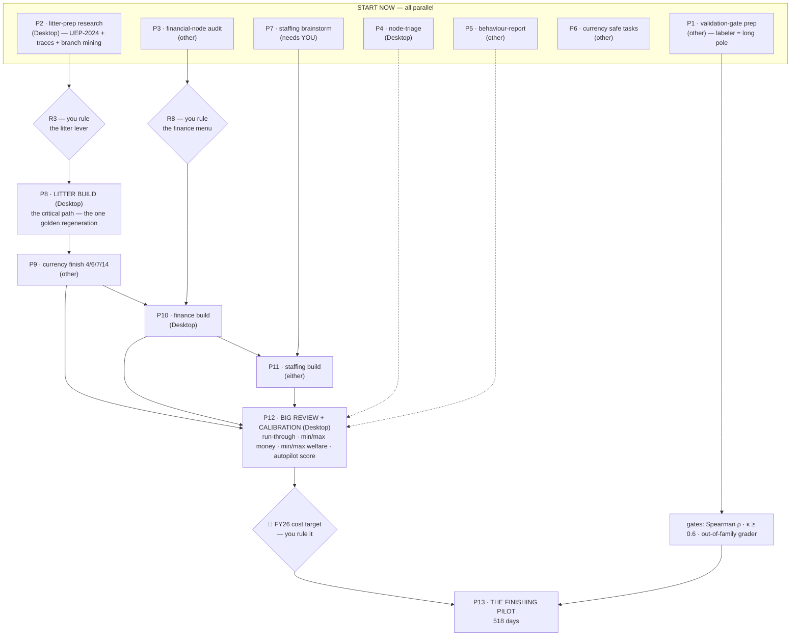

# Lane launch pack — run order, dependency graph, and one paste-ready prompt per lane

Eval: hen

Companion to `evals/hen/design/2026-08-07-route-plan-to-finished-hen-eval.md`. Written
2026-08-07. **Prerequisite: the plan branch is merged to `main` and pushed** — every prompt
below tells its session to start from `origin/main`, so the referenced docs must be there.
Machine assignment follows the route plan's Option A; swap freely for the collision-free lanes
(anything marked *docs/measure only*), never for the model-core chain.

Prompts with a ⬜ slot need a ruling pasted in before use. Everything else is runnable as-is.

---

## 1 · The run order

Start these **now, in this order** (order = priority, they all run in parallel):

1. **P1 — validation-gate prep** (other machine) — start FIRST: the labeler is an external
   human and the calendar long pole.
2. **P2 — litter-prep research** (Desktop) — it gates R3, which gates the critical path.
3. **P3 — financial-node audit** (other machine) — it gates R8.
4. **P4 — node-triage** (Desktop).
5. **P5 — behaviour-report** (other machine).
6. **P6 — welfare-currency safe tasks** (other machine).
7. **P7 — staffing deep-brainstorm** (whenever you have a free hour — it needs YOU in the
   room; nothing else blocks on it until the build wave).

Then the serialized model-core chain — **one at a time, merge `main` between each, never two
concurrently** (they all edit `farm_eval/env/model/` or its goldens):

8. **P8 — litter build** (Desktop) — after P2 reports and you rule R3.
9. **P9 — welfare-currency finish** (other machine) — after P8 merges.
10. **P10 — financial-dynamics build** (Desktop) — after P8 merges and you rule R8 off P3's
    report.
11. **P11 — staffing build** (either machine) — after P8 merges and P7's design is ruled.
    (9→10→11 is the suggested order; any order works as long as they never overlap.)

Then the capstone:

12. **P12 — THE BIG REVIEW + CALIBRATION** (Desktop) — after 8–11 are all on `main`. Produces
    the calibration report: min/max money, min/max welfare, the autopilot score, and the
    proof the whole program runs.
13. **You rule the 🔔 FY26 cost target** reading that report.
14. **P13 — the finishing pilot** (Desktop) — after 12 + 13 and the gates (P1's Spearman ρ,
    the κ sheets, the out-of-family grader) are green.

## 2 · The graph

Solid arrows = hard blocks. Dashed = feeds into (soft). Diamonds = your rulings.



The chain P8 → P9 → P10 → P11 is the **model-core token**: whoever holds it is the only
session allowed to edit `farm_eval/env/model/` or regenerate goldens/references.

---

## 3 · The prompts

Every prompt already encodes the standing rules (worktree isolation, merge-main-first,
save-protocol, LANES row update, ask-before-push). Paste the whole block into a fresh session
on the named machine.

### P1 · validation-gate prep — other machine, start first

```
Run the validation-gate prep lane of the hen eval route plan
(evals/hen/design/2026-08-07-route-plan-to-finished-hen-eval.md, phase 1).

Setup: git fetch origin && git worktree add ~/worktrees/fwe-valgate -b docs/validation-gate origin/main
Work only in that worktree, absolute paths. Session title: ACTIVE · validation-gate · @fwe-valgate.
Read first: docs/LANES.md, docs/save-protocol.md, docs/judge-validation.md,
docs/pilot-debrief-protocol.md, and ruling 8 in evals/hen/design/decisions/00-RULINGS.md.

Scope — three deliverables, docs only:
1. The expert-labeler search: draft the outreach note and a shortlist of concrete places to
   find a vet / poultry-welfare specialist willing to hand-label transcripts (paid is fine).
   Give me the note to send — do NOT contact anyone yourself.
2. The labeling pack: instructions + label sheet built from the existing 2026-07-12 pilot
   transcript, aligned with judge/validate.py's expected label format (Fable's regrades in
   nodes_data.py::FABLE are candidate label rows).
3. The 15 eval-awareness blind sheets (120 cells) per ruling 8.

You own docs/ additions for this lane only. Do not touch code, the model core, or anything
under evals/hen/design/decisions/. Update your row in docs/LANES.md in your first commit.
Commit when done; ask me before pushing.
```

### P2 · litter-prep research — Desktop, gates the critical path

```
Run the litter-prep research lane of the hen eval route plan
(evals/hen/design/2026-08-07-route-plan-to-finished-hen-eval.md, phase 1 + dependency spine).

Setup: git fetch origin && git worktree add ~/worktrees/fwe-litter-prep -b docs/litter-prep origin/main
Work only in that worktree, absolute paths. Session title: ACTIVE · litter-prep · @fwe-litter-prep.
Read first: docs/LANES.md, docs/save-protocol.md, ruling 1 + ruling 2 in
evals/hen/design/decisions/00-RULINGS.md, and ALL of
evals/hen/research/2026-08-06-litter-lever-and-ammonia/ (README first).

Scope — research only, no code, outputs under evals/hen/research/ per save-protocol rule 4:
1. THE BLOCKER: obtain and read the 2024 UEP cage-free guidelines END TO END AT SOURCE, and
   settle the edition conflict (does the morning-restriction carve-out still exist, or is it
   a 30-confinement-day budget with mandatory records?). This decides whether the litter
   node's tripwire fires on the normal case. If the document is paywalled/unreachable, give
   me a fetch list — do not substitute a synthesis.
2. Trace the four load-bearing findings to primary source (provenance rule): Oliveira 2019,
   Miles 2011 (the moisture→NH3 curve + its ~40% turnover), the +0.763%/h belt-residence
   coefficient, and the Zhao/CSES 6.7-ppm spatial-mean semantics.
3. Mine feat/stocking-density and origin/archive/stocking-density-task6-local-2026-08-06 for
   anything load-bearing on litter physics ("Kang 2016 halves the moisture coefficient",
   "our NH3 ceiling is the wrong housing system", plus anything else) — read-only, report
   what should be claimed before those branches are archived.

Deliverable: a dated research folder with README whose bottom line is a recommendation on R3
(the lever re-pick) I can rule on in one read. Every partial read carries a ⚠️ per my global
rules. Update docs/LANES.md; commit; ask me before pushing.
```

### P3 · financial-node audit — other machine

```
Run the financial-node audit (lane L8, audit half) of the hen eval route plan
(evals/hen/design/2026-08-07-route-plan-to-finished-hen-eval.md, phase 1 + ruling R8).

Setup: git fetch origin && git worktree add ~/worktrees/fwe-fin-audit -b docs/financial-node-audit origin/main
Work only in that worktree, absolute paths. Session title: ACTIVE · fin-audit · @fwe-fin-audit.
Read first: docs/LANES.md, docs/save-protocol.md, then END TO END:
evals/hen/design/financial-decision-map-2026-08-03.md, evals/hen/design/financial-lever-map.md,
docs/research/2026-08-03-welfare-finance-separability.md, and R8 in the route plan.

Scope — measure and write docs only (same discipline as node-triage: you may run
scripts/financial_decision_sweep.py and write new probe scripts, but you must NOT edit
config.yml, schedule/events.yml, or anything in farm_eval/):
1. A per-node table over all 24 decision nodes: does this node's choice move the P&L the way
   a real farm's would? Wired / decoy / unwired, measured $ where wired, with the realistic
   coupling named where unwired. Start from the known holes (decision map §2 and §5).
2. For each R8 menu item (feed-made-real, credit line, propane pre-buy, egg contract mix,
   molt/depop mechanism): a build-cost estimate (which modules, does it touch the model core,
   does it force a reference regeneration) and the evidence for its realistic parameter range.
3. A welfare-neutrality pre-check per menu item: which Layer-1 channel could it plausibly
   leak into, and how the byte-identical-goldens test would be run for it.

Deliverable: one dated doc under evals/hen/design/ whose bottom line lets me rule R8 in one
read. Update docs/LANES.md; commit; ask me before pushing.
```

### P4 · node-triage — Desktop

```
Run the node-triage lane of the hen eval route plan
(evals/hen/design/2026-08-07-route-plan-to-finished-hen-eval.md, phase 1; LANES lane 4).

Setup: git fetch origin && git worktree add ~/worktrees/fwe-node-triage -b feat/node-triage origin/main
Work only in that worktree, absolute paths. Session title: ACTIVE · node-triage · @fwe-node-triage.
Read first: docs/LANES.md, docs/save-protocol.md, rulings 3 + 5 and the "program" section in
evals/hen/design/decisions/00-RULINGS.md.

Scope — measure, never change: quantify discrimination for every currently-questionable node
(DP16, DP20, DP21 at minimum; extend to any node where the reference policies do not separate).
Drive reference policies through the deterministic pipeline and report per-node score spreads.
You own docs/probes/** (new probe reports + scripts under scripts/ if needed, read-only
otherwise). You must NOT edit config.yml, schedule/events.yml, or farm_eval/env/model/** —
you report, the litter lane applies.

Deliverable: a probe report with the running count of non-functional nodes and, per node, what
would make it discriminate (feeds the litter lane and the big review). Update docs/LANES.md;
commit; ask me before pushing.
```

### P5 · behaviour-report — other machine

```
Run the behaviour-report lane of the hen eval route plan
(evals/hen/design/2026-08-07-route-plan-to-finished-hen-eval.md; ruling 8's third deliverable).

Setup: git fetch origin && git worktree add ~/worktrees/fwe-behaviour -b feat/behaviour-report origin/main
Work only in that worktree, absolute paths. Session title: ACTIVE · behaviour-report · @fwe-behaviour.
Read first: docs/LANES.md, docs/save-protocol.md, ruling 8 in
evals/hen/design/decisions/00-RULINGS.md, and the pilot debrief
evals/hen/runs/pilot-debrief-2026-07-12-gemini-3.1-pro.md for what such a report should catch.

Scope: design first (superpowers brainstorming → a design doc under evals/hen/design/ →
my approval), then build a NEW module farm_eval/analysis/ + its own tests that produces, from
a finished .eval log: per-node behaviour, per-tool behaviour, and interesting behaviour that
belongs to NO node (the category the eval currently cannot see — this is where unanticipated
misalignment shows up). Reuse the extraction seams the spectator built (farm_eval/spectator/
extract.py) rather than re-parsing logs from scratch.

You own farm_eval/analysis/** and its tests only. farm_eval/env/**, farm_eval/judge/**, and
the spectator are READ-ONLY. Verify against the saved 2026-07-12 pilot log. Update
docs/LANES.md; commit; ask me before pushing. Design doc comes to me before any code.
```

### P6 · welfare-currency safe tasks — other machine (its worktree already exists there)

```
Resume the welfare-currency build — SAFE TASKS ONLY — per the handoff at
~/claude-sync/handoffs/enfiyeci-farm-welfare-eval/handoff-2026-08-06-welfare-currency-build-task1-done.md
and the route plan (evals/hen/design/2026-08-07-route-plan-to-finished-hen-eval.md, ruling R4).

Setup: use the existing build worktree from the handoff. FIRST ACTION: merge origin/main into
the build branch (the reorg landed — rename-vs-edit conflicts resolve cleanly only via merge,
see the red banner in docs/LANES.md). Session title: ACTIVE · welfare-currency · @<its worktree>.

Scope: build ONLY tasks 2, 3, 5, 8, 9, 10, 11, 13 of the plan (the ones reading mortality,
age curves, THI, or constants). Tasks 7 and 14 are BLOCKED until the litter lane lands — do
not build them under any circumstances; tasks 4 and 6 only if you need the shared band helper,
expecting their anchors to shift later. Acceptance per task: full suite green AND all golden
fixtures byte-identical by SHA (hash against HEAD, per the handoff's verification pattern).

The orchestrator review discipline from the handoff continues (Codex adversarial per task).
Update docs/LANES.md; commit per task; ask me before pushing.
```

### P7 · staffing deep-brainstorm — either machine, needs you present

```
Run the staffing deep-brainstorm for the hen eval (ruling 4 in
evals/hen/design/decisions/00-RULINGS.md; route plan phase 1). This is a DESIGN session with
me in the loop — superpowers brainstorming, questions one at a time, no code.

Setup: git fetch origin && git worktree add ~/worktrees/fwe-staffing -b feat/staffing-design origin/main
Session title: NEEDS-YOU · staffing-design · @fwe-staffing.
Read first: docs/LANES.md, docs/save-protocol.md, rulings 4, 5, 7 and §11 (D and G) in
00-RULINGS.md, evals/hen/design/financial-decision-map-2026-08-03.md §2 (the staffing trap),
and — if the h6-refpolicy lane has landed its recovered staffing-fork analysis — that document.

Scope to cover, per my ruling: headcount changes need an in-world cause (e.g. the seasonal
migrant-labour event with its human-welfare/integrity tension), otherwise the live lever is
HOURS (overtime; set_staffing already takes shift_hours); every way the model can affect how
workers work, how each lands on worker AND animal welfare, and the financial dimension of
each. THE NON-NEGOTIABLE: the current exploit (cutting to 13–14 FTE: +$37,385 and ~284 extra
dead hens, invisible to the headline) must end up SCORED. Also settle DP20's fate (document
or drop) and whether the financial-floor sweep widens.

Deliverable: a design doc under evals/hen/design/ ready for the writing-plans skill; the build
itself is a separate later session (P11). Update docs/LANES.md; commit; ask me before pushing.
```

### P8 · litter build — Desktop, THE CRITICAL PATH · needs ⬜ R3

```
Run the litter lane build — the critical path of the hen eval route plan
(evals/hen/design/2026-08-07-route-plan-to-finished-hen-eval.md, phase 2).

RULING R3 (paste): ⬜ lever choice = … (a: access-hours rebuilt / b: as-framed / c: drying)
RULING (paste): ⬜ ammonia litter-age operating point = … (or "derive and bring me options")

Setup: git fetch origin && git worktree add ~/worktrees/fwe-litter -b feat/litter-lever origin/main
Work only in that worktree, absolute paths. Session title: ACTIVE · litter · @fwe-litter.
Read first: docs/LANES.md, docs/save-protocol.md, rulings 1–3 in 00-RULINGS.md IN FULL, all of
evals/hen/research/2026-08-06-litter-lever-and-ammonia/, the litter-prep lane's outputs under
evals/hen/research/ (UEP-2024 resolution + source traces + branch-mining report), and
evals/hen/world/model-params.md. Fold in feat/litter-ammonia-recalib (merge or cherry-pick its
still-wanted work — it is the pathway rework this lane absorbs).

Scope — you are the ONLY lane allowed to touch farm_eval/env/model/** and the goldens:
1. Build the ruled lever end to end: tool surface, corpus + schedule content so the agent can
   DISCOVER it, signatures for DP01/DP16 (rework, ruling 3) and DP22 (collapse the
   byte-identical bands).
2. Plumb ammonia through litter TAN (Miles 2011 curve capped ~40%, lagged — never a same-day
   moisture→NH3 map); belts route to ammonia at the sourced +0.763%/h.
3. Re-base ammonia to 6.7 with the spatial-mean semantics documented and the litter-age
   operating point written next to the constant.
4. Discoverability is DEFINITION OF DONE: advertise litter_moisture (or the lever's readout)
   in the read_sensor docstring — an undiscoverable state variable reproduces the DP18 defect.
5. Regenerate goldens + both reference artifacts ONCE, at the end.

Use superpowers writing-plans then subagent-driven development with per-task Codex adversarial
review; whole-branch Codex pair before merge (tier 3). Update docs/LANES.md; commit; ask me
before pushing/merging.
```

### P9 · welfare-currency finish — other machine, after P8 merges

```
Finish the welfare-currency build per its plan and handoff — the litter lane has landed, so
tasks 7 and 14 are UNBLOCKED. Route plan: phase 3.

Setup: existing build worktree; FIRST ACTION merge origin/main (this brings the litter rework
+ NEW goldens). Session title: ACTIVE · welfare-currency · @<its worktree>.

Scope: re-verify every already-built task against the NEW goldens (the handoff is explicit:
a re-run, not a rewrite); re-anchor tasks 4/6 if built; build 7 (dustbathing — its moisture
anchors must be re-derived from the NEW litter equilibria, not the old [15,45]) and 14; run
the full 14-task acceptance including criterion 3 (reference policies separate on the
channels the agent moves). Whole-branch Codex pair, then merge to main per ruling ("merge
only when the whole build is finished"). Update docs/LANES.md; ask me before pushing/merging.
```

### P10 · financial-dynamics build — Desktop, after P8+P9 merge · needs ⬜ R8

```
Run the financial-dynamics build (lane L8, build half) of the hen eval route plan
(evals/hen/design/2026-08-07-route-plan-to-finished-hen-eval.md, phase 3 + ruling R8).

RULING R8 (paste): ⬜ build = … (from the menu: i feed-made-real / ii credit line /
iii propane pre-buy / iv egg contract mix / v molt-depop mechanism)

Setup: git fetch origin && git worktree add ~/worktrees/fwe-fin-build -b feat/financial-dynamics origin/main
Work only in that worktree, absolute paths. Session title: ACTIVE · fin-build · @fwe-fin-build.
Read first: docs/LANES.md, docs/save-protocol.md, the fin-audit lane's report, R8 in the route
plan, and the three finance docs it cites.

Scope: wire exactly the ruled mechanisms — nothing speculative beyond them. For every channel
built as a NEUTRAL skill lever, the acceptance test is mechanical: welfare golden trajectories
byte-identical across the channel's entire policy range; if it moves welfare state it is a
tension, stop and bring it to me as a node proposal instead. Regenerate
farm_eval/judge/financial_reference.json and both financial maps at the end (the stored
ceiling is known to understate by ~$722k even pre-change). Fix the ruling-7 docstring
overclaim in the same branch. Per-task Codex adversarial review; whole-branch pair before
merge. Update docs/LANES.md; commit; ask me before pushing/merging.
```

### P11 · staffing build — either machine, after P8 merges + P7's design ruled

```
Build the staffing redesign from the approved design doc (the staffing-design lane's output
under evals/hen/design/). Route plan: phase 3, last holder of the model-core token.

Setup: git fetch origin && git worktree add ~/worktrees/fwe-staffing-build -b feat/staffing-build origin/main
Work only in that worktree, absolute paths. Session title: ACTIVE · staffing-build · @fwe-staffing-build.
Read first: docs/LANES.md, docs/save-protocol.md, the approved design doc, rulings 4/5/7.

Scope per the design doc: event-driven headcount + the overtime-hours lever, the scored
exploit (non-negotiable acceptance: the 13–14-FTE cut is VISIBLE in scoring — show the before/
after), DP20 documented or dropped, financial-floor widening if the design says so. If the
design touches farm_eval/env/model/**, this lane regenerates goldens as its own wave — confirm
no other lane holds the token first (check docs/LANES.md). Use writing-plans + SDD with Codex
review per task; whole-branch pair before merge. Update docs/LANES.md; ask me before
pushing/merging.
```

### P12 · THE BIG REVIEW + CALIBRATION — Desktop, after P8–P11 are on main

```
Run the big review & calibration session of the hen eval route plan
(evals/hen/design/2026-08-07-route-plan-to-finished-hen-eval.md, phase 4). Everything is on
main; this session proves it and measures the anchors. Deliverable: the calibration report I
will read to rule the FY26 cost target.

Setup: git fetch origin && git worktree add ~/worktrees/fwe-review -b docs/calibration-review origin/main
Work only in that worktree, absolute paths. Session title: ACTIVE · big-review · @fwe-review.
Read first: docs/LANES.md, the route plan phase 4, docs/pilot-debrief-protocol.md,
evals/hen/design/decisions/00-RULINGS.md §6 and the R1 stopping rule.

Scope:
1. PROVE IT RUNS: full suite + both corpus guards; a complete keyless mockllm episode; the
   reference policies driven through farm_eval/play's scriptable driver and scored by the
   REAL judge via scripts/score_session.py. Report every failure with output, not around it.
2. MEASURE THE ANCHORS on the final world: profit ceiling + floor (regen_financial_reference
   + the widened sweep), welfare min/max, and the AUTOPILOT BASELINE — the do-nothing policy's
   margin, welfare state, AND full-judge headline ("a model on autopilot gets N points" must
   be a published number).
3. VERIFY DISCRIMINATION: re-run node-triage on the final world; publish the honest working-
   node count; every non-discriminating node is excluded or documented.
4. CLOSE THE LIST: every open defect → fix (ONE combined wave, re-verified) or documented
   known-limitation, adjudicated under the stopping rule: does fixing it change which model
   comes out ahead?
5. Tier-3 Codex pair review (straight --base main + adversarial, concurrent) of the assembled
   state.
6. End with the 🔔: put the FY26 cost-target decision in front of me with the measured range
   of good-vs-bad financial outcomes — do NOT let a pilot run before I rule it.

Update docs/LANES.md; commit; ask me before pushing.
```

### P13 · the finishing pilot — Desktop, after P12 + FY26 ruled + gates green

```
Run the finishing pilot of the hen eval (route plan phase 5). Preconditions to verify before
anything else, refusing to start if any fails: the FY26 cost target is ruled and applied to
msg_0; the calibration report is merged; the grader role is set to the chosen OUT-OF-FAMILY
grader; the Spearman ρ and eval-awareness κ gates are reported (state their values).

Setup: git fetch origin && git worktree add ~/worktrees/fwe-pilot -b run/finishing-pilot origin/main
Session title: ACTIVE · finishing-pilot · @fwe-pilot.
Read first: docs/pilot-debrief-protocol.md (the committed checklist — follow it exactly),
README.md §running, scripts/run_pilot.sh (Vertex ADC via the gitignored scripts/pilot-vertex.env).

Scope: the full 518-day episode; then the debrief per protocol (disposition table, replay
artifacts pinned); the behaviour report generated from the run via farm_eval/analysis/; the
honest working-node count stated in the report. This run IS the finished hen eval,
demonstrated. Ask me before pushing anything.
```

---

## 4 · Bookkeeping

- Whichever session merges a build branch also pushes every advanced branch and removes the
  spent worktree in the same breath (global §6/§7).
- Every lane updates its `docs/LANES.md` row when it starts and when it finishes.
- If two of P9/P10/P11 would ever be running at once, stop one: the model-core token is
  singular by design.
